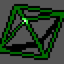

# Shadowrun Defragged: An Unofficial Bug-Fix Mod for *Shadowrun* (Sega Genesis)

> **Unofficial fan project.** Not affiliated with or endorsed by any rights
> holder of *Shadowrun*. This repository contains no ROM data -
> see [License & Legal](#license--legal).

*Defragged* is a set of 30+ patches containing bug fixes and balance
improvements for the Sega Genesis release of *Shadowrun* (1994). This is not a
game overhaul or redesign, just an extra layer of polish over the game's rough
edges. The goal is to fix obvious bugs and balance issues while staying
reasonably faithful to the original design.

*Defragged* comes in two flavors:
 - **Defragged** (recommended): Fixes 20+ bugs, makes several targeted balance
   adjustments, and re-works the frustrating Tar Pit mechanic.
 - **Defragged Core**: A subset which includes only strict, unambiguous bug fixes.

It's also possible to build a custom patch - [see below](#specifying-a-manifest-or-a-custom-patch).

**Patch Highlights:**
 - Fixes numerous combat system bugs: weapon attachments not working reliably,
   inconsistent bonuses from cyberware, instant death in melee when using Wired
   Reflexes, and more.
 - Fixes spell system glitches that made multiple-caster parties non-viable.
 - Makes the Power Focus and Protection Talisman work intuitively.
 - Fixes glitches in the final boss encounter, including a progression
   soft-lock and weird AI behavior.
 - Reworks Tar Pit to no longer delete programs permanently - it just disables
   them until the end of the run.
 - Subtle balance tweaks, including making magic damage from Hell Hounds and
   Thon slightly easier to resist with high stats.
 - Various UI bug fixes, improved tooltips, and more!

**[Full list of changes in release_notes.md.](release_notes.md)**

In addition to the patches themselves, this repo hosts the individual patch
definitions (with byte-by-byte explanation), research documentation and
rationale for each patch, diagnostic tools, and a lightweight patch-builder
framework. This aims to educate others and support future work on Sega Genesis
reverse-engineering and modding.

## How To Play
Most players who want to try *Defragged* should simply download one of the two
pre-built BPS ROM patches, which can be applied with any standard ROM-patcher
software that supports the BPS format (search "genesis rom patcher"):
 - **Defragged** (recommended): [shadowrun-defragged-v1.0.bps](https://github.com/benfoxworthy/shadowrun-defragged/releases/download/v1.0/shadowrun-defragged-v1.0.bps)
 - **Defragged Core**: [shadowrun-defragged-core-v1.0.bps](https://github.com/benfoxworthy/shadowrun-defragged/releases/download/v1.0/shadowrun-defragged-core-v1.0.bps)

To confirm a download is intact, compare its SHA-256 against these values:

```text
shadowrun-defragged-v1.0.bps       9344A6BFFB718370129FD97D3DDBDB1BA0D9E4B71E358B11FD8FE7B7958497E2
shadowrun-defragged-core-v1.0.bps  116B00E8FE6A6F3460F3FE2D3FA4039E98F7ED01FE3FE339EE9A11D417F62AED
```

You will need to obtain your own legal copy of the *Shadowrun* ROM. This
project never contains or distributes a ROM image.

If you'd like to build the patch yourself instead, see
[Building *Defragged* From Source](#building-defragged-from-source).

#### Save Game Compatibility
To my knowledge, all flavors of *Defragged* are fully compatible with existing
saved games. Saves are also compatible between the two flavors.

Loading save states between unpatched ROMs and *Defragged* (or between different
*Defragged* builds) seems to work fine in practice, but in theory could cause a
crash or bad behavior. A safer option is to use a real in-game SRAM save when
transferring between different *Shadowrun* ROMs.

#### Platform/Emulator Compatibility
Testing has been primarily with Fusion 3.64 and (very minimally) with BlastEm.
Other emulators should work, but haven't been tested. Feel free to report any
issues.

#### Compatibility with other *Shadowrun* ROM hacks
I did not test or attempt to preserve any compatibility with existing ROM
hacks. This could be future work if there is demand.

## Project structure

```text
images/                          Images referenced in this README
patch_framework/                 Patch definition and construction API
  __init__.py                    Public framework exports
  patch_framework.py             Framework implementation
patches/                         Authoritative patch definitions
  <patch_id>.py                  One independently selectable patch
  <patch_id>_research.md         Additional documentation for some patches
tests/                           Builder, allocator, checksum, and patch tests
tools/                           Tools to help create & debug new patches
  generate_preimage_guard.py     Utility to generate source-ROM checksum metadata for each patch
  inspect_save_state.py          Extracts debug info embedded in Defragged save states
build_shadowrun_defragged.py     BPS and patched-ROM builder
manifest_core.json               Bug-fix only patch manifest
manifest_full.json               Full release patch manifest
manifest_diagnostics.json        Diagnostics-only manifest (used to debug the base game)
release_notes.md                 Full list of changes in the current release
```

## Building *Defragged* From Source
Python 3.10 or newer is required.

The simplest way to build is to run the builder with no arguments, which
generates a .bps patch which can be applied with a ROM patcher tool.

```powershell
python build_shadowrun_defragged.py
```

Alternatively, you can patch a (legally-obtained) ROM directly using:
```powershell
python build_shadowrun_defragged.py --source-rom <path/to/Shadowrun.bin>
```

Use `--output-bps` or `--output-rom` to change the output filepath.

### Specifying a manifest or a custom patch
The script builds [`manifest_full.json`](manifest_full.json) by default. You can build a
different set of patches using the `--manifest` option (either
[`manifest_core.json`](manifest_core.json) or your own custom manifest), or by passing a
comma-separated list of patches using the `--patches` option.

You can list every available patch using `--list`.

### ROM Compatibility

The canonical source ROM is `Shadowrun (USA)`
 - Size: 2,097,152 bytes
 - SHA-1: `A06A281D39E845BFF446A541B2FF48E1D93143C2`
 - CRC-32: `FBB92909`

If no source ROM is supplied, the generated BPS targets this canonical ROM. If
a supplied ROM has different SHA-1 or CRC-32 values (for example: an
already-modified ROM), the builder prints a warning and proceeds only if every
selected edit's source data matches. Any mismatch at a patch site is a hard
error.

### Running Tests

Run the framework's unit tests with `python -m unittest discover -s tests`.
Some tests require a canonical *Shadowrun* ROM located at
`roms/Shadowrun (USA).gen`, but will simply skip if the ROM is not present.

## Technical Details

This project started without any intention of making a ROM hack - I was just
curious about all of the weird bugs and behavior I've observed in *Shadowrun*
over the years, and I felt I could finally get to the bottom of it with AI
tools. I developed a reverse-engineering pipeline so that I could understand
the game's combat formulas and other behavior.

Once the game code was well-understood, it turned out to be fairly easy to
develop fixes for many of the bugs I found - which led to this project.

*Defragged* was built primarily using OpenAI's GPT 5.6 Sol.

### Disassembly & Labeling
I started by extracting game code & assets so that I could
finally (after 20+ years) understand the game's exact formulas and behavior.
I used an existing Sega Genesis disassembler tool, [sega2asm](https://github.com/hansbonini/sega2asm),
which was able to convert much of the raw binary into Motorola 68000 assembly
code. However, raw assembly code is still not very readable or useful - it
needs to be understood and labeled. Raw addresses need to be assigned a
function or variable name before the code can be interpreted.

I found that GPT 5.6 was quite good at this. I used Codex to scan the
disassembly, interpret the raw instructions, and propose function labels.
This was a recursive process: As more code was understood, labeling the
remaining code became easier. In particular, discovering key functions like
`roll_dice_pool_success_test`, `try_spend_nuyen`, and `dispatch_dialogue_action`
(GPT-invented names) was helpful to identify large portions of game systems
code. I asked Codex to use sub-agents to divide up and scan chunks of the
game binary, propose labels only when it could do so with high confidence,
then consolidate and repeat.

Once I had enough code labeled, it became possible for Codex to read and
interpret the game code with high accuracy. At this point Codex was able to
fix bugs or change behavior with a high success rate.

### Finding Code Space

Many bugs can be fixed in-place by simply patching over the existing bytes
in the ROM, but more complex fixes often require adding completely new code.
This requires either expanding the size of the ROM, or identifying unused space
in the original ROM that can be overwritten. I preferred working within the
existing space if I could because I wasn't sure about the complexity or side
effects of growing the ROM.

Static analysis of the ROM found two potential candidates:
1. A 458-byte "tail" of `FF`-filled space at the very end of the ROM
2. Two seemingly-unused animated sprites starting at `0x0E51D8`, which use 2,944
bytes and 2,560 bytes respectively; Codex could not find any code that loads
them.

| Orb with Rings (2,944 bytes) | Spinning Polyhedron (2,560 bytes) |
| :---: | :---: |
|  |  |

(The colors are a guess. The sprites can render with any of the game's
palettes - since they are never loaded or used, it's impossible to tell the
intended palette. Here, I rendered them with the Orange / Green palettes used
for Matrix nodes.)

The first option was higher-confidence, but not enough space. Therefore
*Defragged* overwrites one of the animations: a 2,944-byte range at
`0x0E51D8..0x0E5D57`. The patcher validates that complete source range and
replaces it all with `FF` before writing new code to it. So far, this is
enough space for all of the *Defragged* patches.

The 458-byte tail and the second adjacent 2,560-byte polyhedron animation
remain as-is and could be used for future patches.

### Dynamic Patching & Patch Structure

Any change to a patch can slightly change the size, which requires repacking
and adjusting the addresses of all later patches. To handle this, *Defragged*
uses a dynamic modular patching system that automatically manages code space.

Each patch module owns:
- its name, ID, and other metadata
- descriptions/explanations of the changes
- one `build_patch` method containing its implementation

Within the `build_patch` method, a patch implementation can contain two types
of edits:
 - `replace`: an in-place edit that directly modifies some bytes
 - `add_cave`: A dynamically-allocated chunk of new binary code

`builder.add_cave` returns the address of the code that was added, which can
then be used in another operation (usually a `replace`) to call the new code.

The patcher then simply calls `build_patch` for each patch in the manifest. If
the size of the included patches exceeds the available ROM space, it will
generate an error.

Each `replace` edit also needs a `source_genesis_sum` and
`source_crc32_influence` from the original ROM. These are used for ROM checksum
calculations and for validating the source replacement bytes. This technique
avoids including even small snippets of original ROM bytes in the project. Both
values can be generated using the `generate_preimage_guard.py` tool.

The patch infrastructure itself is not *Shadowrun*-specific other than the
addresses used for the cave allocation, and could easily be forked for a
different ROM-hacking project.

### Diagnostics Tools

I found it difficult and time-consuming to test certain patches - especially
balance changes which depend on die rolls. This led to the creation of the
`defragged-diagnostics` patch, which is included in every manifest. It does
two things:

1. Stamps a build identifier to a specific memory address every frame.
2. Adds a "combat log" of sorts by hooking the dice roller routine.

The data is written to an unused portion of RAM: Analysis showed that
*Shadowrun* reserves 2048 bytes for save data (likely to have a nice round
number to copy in/out of SRAM), but didn't use all of it. This left a 460-byte
chunk of unused space at the end of the buffer. This space IS written into
saved games, but never read from, so writing to it does not affect saved game
compatibility.

After the 20-byte build identifier stamp and an 8-byte log header, the dice log
uses the remaining 432 bytes to store a rolling log of the last 54 dice events.
Each entry contains the number of dice rolled, the Target Number rolled
against, the result, a frame number, and the address of the caller - which can
be mapped to a specific event label.

The diagnostic data can be extracted out of a *Defragged* save state
using the `inspect_save_state.py` tool, and outputs results like this:

``` text
Defragged B776-DBCD
format=1 record_size=8 retained=19/54 patch_crc=DBCD rom_checksum=B776
seq slot frame  dF caller    dice  TN result  event
  0    0   89  -- 000556AA     6   3      5  Firearm attack
  1    1   B5  44 000556AA     6   3      1  Firearm attack
  2    2   E1  44 000556AA     6   3      4  Firearm attack
  3    3   FE  29 000103B2     6   4      2  Targeted spell attack
  4    4   01   3 000556AA     6   4      3  Firearm attack
  5    5   08   7 000559CE     7   9      0  Non-melee damage resistance
  6    6   08   0 000559CE    12   2      9  Non-melee damage resistance
  7    7   2D  37 000556AA     6   4      5  Firearm attack
  8    8   34   7 000559CE     7   9      2  Non-melee damage resistance
```
This log makes it possible to directly inspect whether a patch has the intended
effect on dice rolls. In addition to combat tests, the log also shows results
from Electronics checks, Medkit use, encounters, and so on.

## License & Legal

*Defragged* is an unofficial fan project. It is not affiliated with, endorsed
by, or sponsored by Sega, Microsoft, or any other rights holder of *Shadowrun*
or the Sega Genesis. *Shadowrun*, Sega, Sega Genesis, and all related
trademarks and copyrights belong to their respective owners.

This repository contains only original work - patch definitions, newly written
patched bytes, research documentation, and build tooling - apart from two
unused sprite animations [reproduced above](#finding-code-space) for
documentation purposes. It does not contain the *Shadowrun* ROM or any copied
ROM bytes, and nothing in this repository grants any rights to the original
game. To play *Defragged*, you must supply your own legally obtained copy of
the game.

The original content of this repository is licensed under the MIT License -
see [LICENSE](LICENSE).
